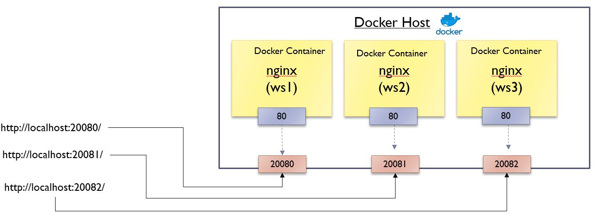

<h1>Exercise: Running three instances of nginx web server</h1>

Complete the following exercises in <b>Tab 1</b>. End the running session by clicking `CTRL+C`.

Start three instances of nginx docker containers. 

Use the -d option runs the container in detached mode (the server will run in background). Execute:

> `docker run -d -p 20080:80 --name ws1 nginx`{{execute}}

> `docker run -d -p 20081:80 --name ws2 nginx`{{execute}}

Check that there are TWO running Nginx containers. Execute:

> `docker container ls`{{execute}}

> `docker exec ws1 /bin/bash -c "echo 'This is server 1' > /usr/share/nginx/html/index.html"`{{execute}}

> `docker exec ws2 /bin/bash -c "echo 'This is server 2' > /usr/share/nginx/html/index.html"`{{execute}}

Similarly, create the third web instance of the webserver  which outputs "This is server 3". Map the container port "80" to host port "20082".

In Killercoda, access the localhost by clicking the top-right menu and choose "Traffic / Ports". Type in 20080 / 20081 / 20082 to check different ports.