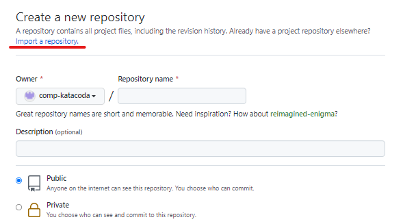
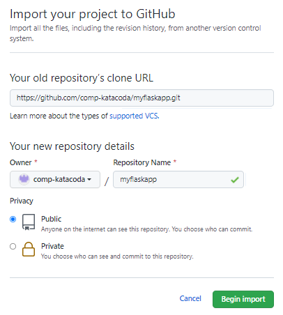
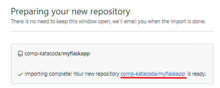
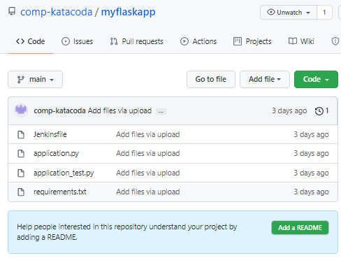

# Setup for Jenkins repository

## Open GitHub account and Clone Repository
Login your GitHub account (If you do not have one, please create it before you continue the following steps).

 

Create a new public repository and click the link **Import a repository**:

 

Copy the clone URL `https://github.com/comp-katacoda/myflaskapp.git`{{copy}} and place under "Your old repository's clone URL". Fill in Repository Name as "_myflaskapp_". Click "Begin import":

 

Click on the link to open your repository:

 

You should see four files inside the repository:

 