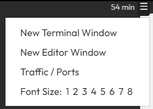
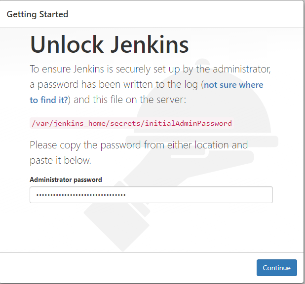
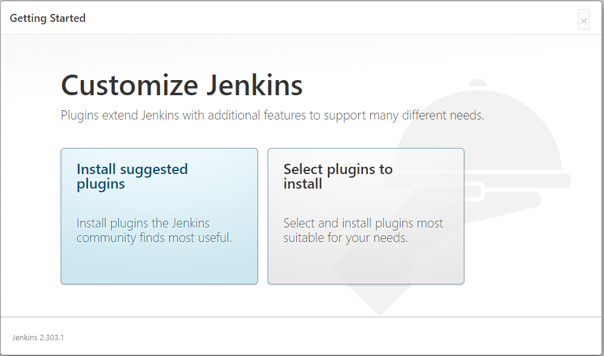
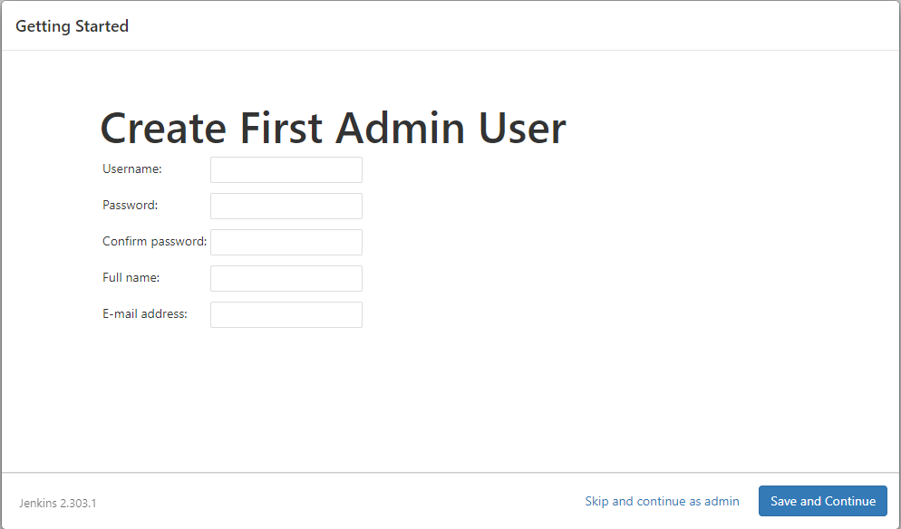
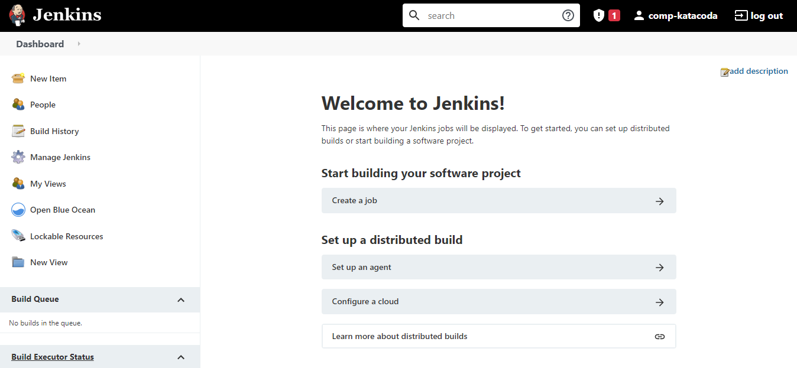

# Logging in Jenkins on Browser

Please open the menus on the top right corner and choose **Traffic/Ports**. Click the **8080** port to access Jenkins website.

Login with the password, which is the one generated before between the 2 sets of asterisks. You can find the password again by executing the following code:
> `docker logs jenkins-tutorial`{{exec}}

Click **Install suggested plugins**. Wait it to finish loading.

Jenkins will then ask you to create your first adminstrator user. Specify your details in the corresponding fields and click **Save and Finish**. 

Load until the **Jenkins is ready** page appears, and click **Start using Jenkins**. 

The dashboard is shown at last.

 