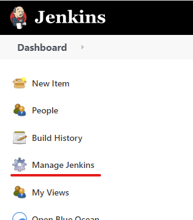
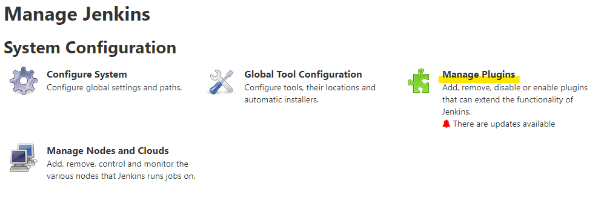
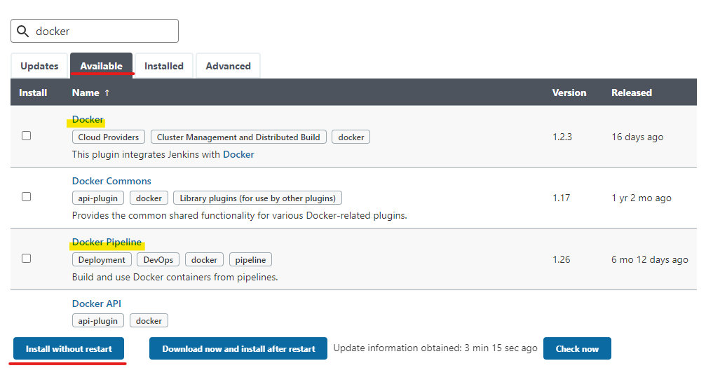
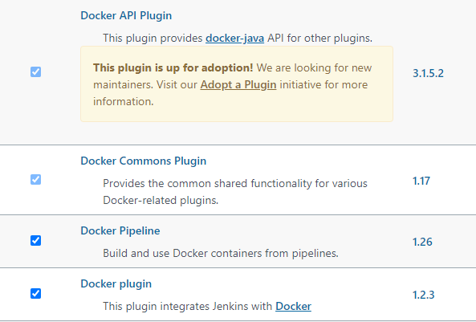

# Install Plugins

Click **Manage Jenkins**: 

 

Click **Manage Plugins**:

 

Click the **Available** tab. Search `Docker` and `Docker Pipeline`. Select both of them and click **Install without restart**.

 

Check whether the plugins are installed by selecting **Installed** tab. You should see the following four plugins:

Return to dashboard.

 