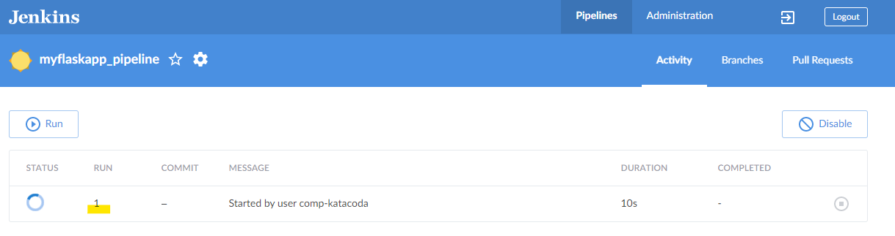
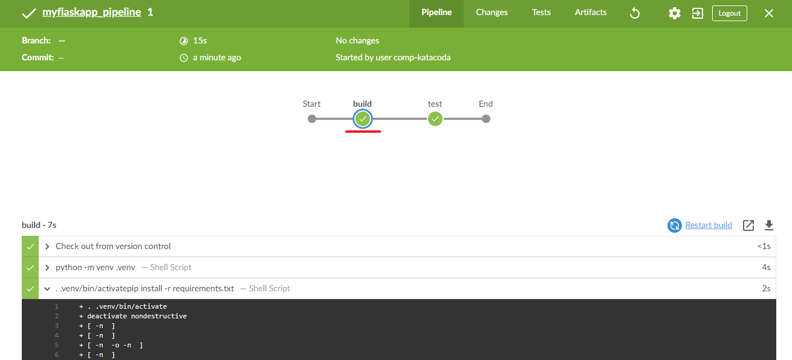
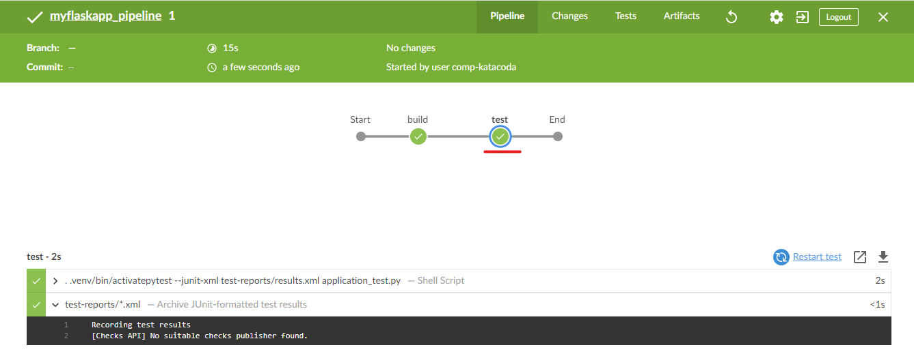

# Running the pipeline

Click "Open Blue Ocean" on the left to access Jenkins’s Blue Ocean interface.

Click "Run".

Click the "run 1" to examine the process.

Click the "build" stage. Expand the steps to view the console log of each of the steps.

Click the "test" stage. Expand the steps to view the console log of each step.

Click the "X" at the top-right to return to the main Blue Ocean interface.
Whenever there are new commits in the Git repository, you may click "Run" to execute the pipeline.

Click "run 2" and click "Tests" tag to view the results of executing the automated tests.

Click the exit icon to go back to the classic view.

You may view the build history and the test results in the dashboard.

 