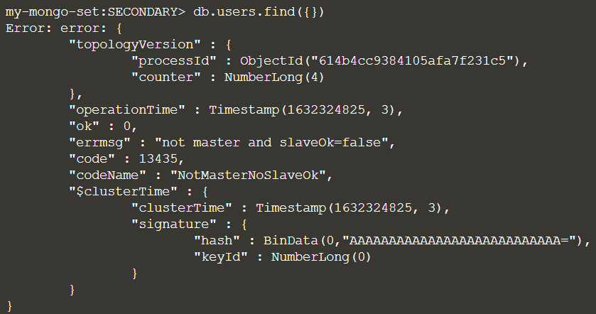

Start the replica set by running:
> `rs.initiate(config)`{{execute}}

The three mongod servers we started earlier will now coordinate and come online as a replica set.

The prompt will indicate whether the instance is the primary/secondary database. 
- If it is the primary, it will show

  

- If it is the secondary, it will show

  
 
You can check the replica set status using the following command
> `rs.status()`{{execute}}

The above command returns a JSON object. You may show only the “members” attribute as follows.
> `rs.status()["members"]`{{execute}}

In the primary database, insert a sample document into users collection and then list the documents in the collection.
> `db.users.insertOne({ "Name" : "Peter", Age : 24, Gender : " Male" })`{{execute}}

> `db.users.find({})`{{execute}}

Open a new terminal Tab 2. In Tab 2, make a connection to one of our secondary databases, E.g.
> `docker exec -it mongo3 mongo`{{execute}}

Reading from the secondary database will generate an error.
> `db.users.find({})`{{execute}}

To read from secondary and prevent the error, you should specify the read preference. 
> `db.users.find({}).readPref("secondary");`{{execute}}

We can also configure the current session to allow read operations from non-master instances.
> `db.getMongo().setSecondaryOk()`{{execute}}

Check the collections and documents in secondary.
> `show collections`{{execute}}

> `db.users.find({})`{{execute}}

Exit the various mongo connection sessions:
> `exit`{{execute}}